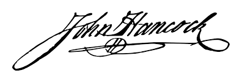

```{r setup, include=F}


place <- "ACME Corp."
jobtitle <- "data scientist and haberdasher"


```

I write to apply for your recently advertised opening of `r jobtitle` at `r place`. I think I would be awesome there if you gave me money to do stuff for you. Please give me money to do stuff for you.

I have experience with and will be very good at:

* Implementing the glamour of graphics to help with your budget reports
* Using tidyverse to fix your customer data reports
* Training new R users in your business intelligence team

Morbi auctor pulvinar metus et facilisis. Cras eget mollis lorem. In hac habitasse platea dictumst. Fusce facilisis nec ligula in egestas. Maecenas turpis tortor, accumsan eget lacus facilisis, interdum egestas nibh. In efficitur dictum accumsan. Etiam a porta ante. Ut dui nibh, vestibulum in aliquet et, mollis nec enim.

See my [datadrivencv resume](http://nickstrayer.me/datadrivencv/) and [GitHub portfolio](https://github.com/) for examples of projects that demonstrate these skills. I look forward to hearing from you.

Best regards,

```{r eval=TRUE, echo=FALSE, out.width='30%'}

```

Steven V. Miller
